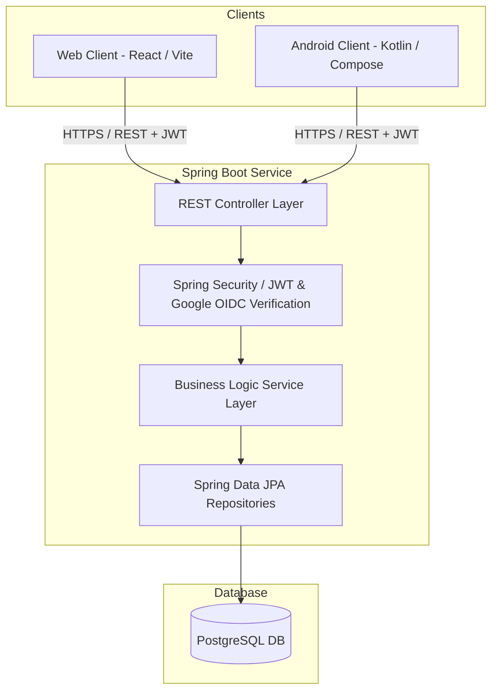

# Budget Tracker Application: Functional & Technical Specification

This document details the functional and technical specifications for the Budget Tracker app. The system consists of a Spring Boot (Java) backend, a PostgreSQL database, a React/Vite Web client, and an Android client (Kotlin + Jetpack Compose).

---

## 1. System Overview & Architecture

The Budget Tracker is an online-only, multi-client application designed to manage personal finance across multiple currencies, track budgets (spending goals), savings goals, and accounts (checking/savings).



---

## 2. User Authentication & Security Flow

Authentication is built around Google Accounts (OAuth2 / OIDC) to provide a passwordless, secure login experience.

### Step-by-Step Flow
1. **Client Login**: The user initiates login on the client app (using the Google Identity Services SDK on Web or the Credential Manager API on Android).
2. **Google ID Token**: Google authenticates the user and returns a cryptographically signed **Google ID Token** to the client.
3. **Session Exchange**: The client sends the Google ID Token via `POST /v1/tokens`.
4. **Token Verification**: The Spring Boot backend validates the token using the Google API Client Library to confirm expiration, issuer (`accounts.google.com`), and client IDs.
5. **User Provisioning**:
    * The backend extracts the unique Google `sub` (subject ID) and `email`.
    * It checks the database for a user with this `google_sub`.
    * If not found, a new user is inserted, and a set of **default categories** (e.g., Food, Utilities, Salary) is auto-seeded for them.
6. **JWT Generation**: The backend issues a custom, short-lived **JSON Web Token (JWT)** containing application-specific claims (such as the internal database `userId`) signed with the backend's private key.
7. **Authorized Requests**: The client stores this custom JWT securely (EncryptedSharedPreferences on Android; session memory or Secure/HttpOnly Cookies on Web) and attaches it as `Authorization: Bearer <TOKEN>` in the headers of all subsequent requests.

---

## 3. Core Functional Specification

### A. User Profiles & Currencies
* **Default Currency**: Each user must configure a default currency (e.g., `USD`, `EUR`, `CAD`).
* **Multi-Currency Transactions**: If a transaction is entered in a currency other than the user's default:
    * The system stores the original amount and currency code.
    * The system stores the converted amount in the user's default currency.
    * The system captures and stores the exact exchange rate used at the time of the transaction.

### B. Accounts & Wallets
* **User Accounts**: A user can create an arbitrary number of custom-named accounts.
* **Account Types**: Classified strictly as either `CHECKING` or `SAVINGS`.
* **Account Balances**: Tracked dynamically or as cached fields reconciled by transaction histories.
* **Optional Transaction Link**: Transactions and recurring templates can optionally be linked to one of these accounts, though it is not mandatory.

### C. Hierarchical Categories
* **Types**: Root-level categories are categorized into `INCOME`, `EXPENSE`, and `SAVINGS`.
* **Hierarchy**: Supports a parent-child relationship (self-referencing database structure) to allow two levels initially (e.g., `Food` -> `Groceries`), with future-proof support for arbitrary depths (sub-subcategories).
* **Seeding**: New users are automatically initialized with standard default categories.

### D. Transaction Management
* **Properties**: Each transaction consists of:
    * `date` (Timestamp, required)
    * `category` (Category Reference, required)
    * `currency` (Currency Code, required)
    * `amount` (Original value, required)
    * `convertedAmount` (Value in default currency, required)
    * `exchangeRate` (Rate relative to default currency, required)
    * `account` (Account Reference, optional)
    * `notes` (Text note, optional)
* **Recurrence**: Transactions can be marked as recurring (daily, weekly, monthly, yearly) using recurrence rule templates, which trigger automatic transaction entries on the backend.

### E. Budgeting (Spending Goals)
* **Spending Goals**: Created on categories of type `EXPENSE`.
* **Flexible Hierarchy**: Can be configured at any level of the category tree (e.g., set a budget of $500 for the parent category `Food`, or a specific budget of $150 on the leaf `Dining Out`).
* **Flexible Periods**: Defined by custom `startDate` and `endDate` boundaries rather than static calendar months.
* **No Rollover**: Budget limits start fresh every period. However, database fields are designed with `rolloverRule` (defaulting to `NONE`) to ensure clean future extensions.

### F. Savings Goals
* **Goal Setup**: Set on categories of type `SAVINGS` at any level.
* **Tracking**: Target amounts are tracked against accumulated transactions/transfers associated with that savings category.
* **Periodicity**: Configured with target deadlines (`targetDate`) and monitored via progress calculations.

---

## 4. Database Schema (PostgreSQL Dialect)

```sql
-- Enums
CREATE TYPE account_type AS ENUM ('CHECKING', 'SAVINGS');
CREATE TYPE category_type AS ENUM ('INCOME', 'EXPENSE', 'SAVINGS');
CREATE TYPE recurrence_frequency AS ENUM ('DAILY', 'WEEKLY', 'MONTHLY', 'YEARLY');
CREATE TYPE rollover_rule_type AS ENUM ('NONE', 'SURPLUS', 'DEFICIT', 'ALL');

-- Users Table
CREATE TABLE users (
    id BIGSERIAL PRIMARY KEY,
    email VARCHAR(255) NOT NULL UNIQUE,
    google_sub VARCHAR(255) NOT NULL UNIQUE,
    default_currency VARCHAR(3) NOT NULL DEFAULT 'USD',
    created_at TIMESTAMP NOT NULL DEFAULT NOW(),
    updated_at TIMESTAMP NOT NULL DEFAULT NOW()
);

-- Accounts Table
CREATE TABLE accounts (
    id BIGSERIAL PRIMARY KEY,
    user_id BIGINT NOT NULL REFERENCES users(id) ON DELETE CASCADE,
    name VARCHAR(100) NOT NULL,
    type account_type NOT NULL,
    balance DECIMAL(15, 4) NOT NULL DEFAULT 0.0000,
    currency VARCHAR(3) NOT NULL,
    created_at TIMESTAMP NOT NULL DEFAULT NOW(),
    updated_at TIMESTAMP NOT NULL DEFAULT NOW()
);

-- Categories Table
CREATE TABLE categories (
    id BIGSERIAL PRIMARY KEY,
    user_id BIGINT REFERENCES users(id) ON DELETE CASCADE, -- NULL means default system-wide category
    parent_id BIGINT REFERENCES categories(id) ON DELETE CASCADE,
    name VARCHAR(100) NOT NULL,
    icon VARCHAR(50),
    color VARCHAR(7), -- Hex code, e.g., '#FF5733'
    type category_type NOT NULL,
    created_at TIMESTAMP NOT NULL DEFAULT NOW(),
    updated_at TIMESTAMP NOT NULL DEFAULT NOW()
);

-- Recurrence Rules Table
CREATE TABLE recurrence_rules (
    id BIGSERIAL PRIMARY KEY,
    frequency recurrence_frequency NOT NULL,
    interval INT NOT NULL DEFAULT 1,
    start_date DATE NOT NULL,
    end_date DATE,
    created_at TIMESTAMP NOT NULL DEFAULT NOW(),
    updated_at TIMESTAMP NOT NULL DEFAULT NOW()
);

-- Transactions Table
CREATE TABLE transactions (
    id BIGSERIAL PRIMARY KEY,
    user_id BIGINT NOT NULL REFERENCES users(id) ON DELETE CASCADE,
    category_id BIGINT NOT NULL REFERENCES categories(id),
    account_id BIGINT REFERENCES accounts(id) ON DELETE SET NULL,
    recurrence_rule_id BIGINT REFERENCES recurrence_rules(id) ON DELETE SET NULL,
    amount DECIMAL(15, 4) NOT NULL,
    currency VARCHAR(3) NOT NULL,
    converted_amount DECIMAL(15, 4) NOT NULL,
    exchange_rate DECIMAL(15, 6) NOT NULL DEFAULT 1.000000,
    type category_type NOT NULL,
    notes TEXT,
    date TIMESTAMP NOT NULL,
    created_at TIMESTAMP NOT NULL DEFAULT NOW(),
    updated_at TIMESTAMP NOT NULL DEFAULT NOW()
);

-- Budgets Table (Spending Goals)
CREATE TABLE budgets (
    id BIGSERIAL PRIMARY KEY,
    user_id BIGINT NOT NULL REFERENCES users(id) ON DELETE CASCADE,
    category_id BIGINT NOT NULL REFERENCES categories(id) ON DELETE CASCADE,
    amount_limit DECIMAL(15, 4) NOT NULL,
    start_date DATE NOT NULL,
    end_date DATE NOT NULL,
    rollover_rule rollover_rule_type NOT NULL DEFAULT 'NONE',
    created_at TIMESTAMP NOT NULL DEFAULT NOW(),
    updated_at TIMESTAMP NOT NULL DEFAULT NOW(),
    CONSTRAINT chk_dates CHECK (start_date <= end_date)
);

-- Savings Goals Table
CREATE TABLE savings_goals (
    id BIGSERIAL PRIMARY KEY,
    user_id BIGINT NOT NULL REFERENCES users(id) ON DELETE CASCADE,
    category_id BIGINT NOT NULL REFERENCES categories(id) ON DELETE CASCADE,
    target_amount DECIMAL(15, 4) NOT NULL,
    current_amount DECIMAL(15, 4) NOT NULL DEFAULT 0.0000,
    target_date DATE,
    created_at TIMESTAMP NOT NULL DEFAULT NOW(),
    updated_at TIMESTAMP NOT NULL DEFAULT NOW()
);
```

---

## 5. REST API Specification (Zalando Guidelines)

API endpoints are designed without `/api` prefixes, using kebab-case path segments, plural nouns, and camelCase for JSON properties and query parameters.

### A. Authentication & Sessions
* **`POST /v1/tokens`**
    * *Purpose*: Exchanging Google ID Token for custom backend JWT.
    * *Request Body*:
      ```json
      {
        "googleIdToken": "string"
      }
      ```
    * *Response (201 Created)*:
      ```json
      {
        "token": "eyJhbGciOi...",
        "expiresAt": "2026-06-13T13:46:08Z"
      }
      ```

### B. User Settings
* **`GET /v1/users/me`**
    * *Response (200 OK)*:
      ```json
      {
        "id": 1,
        "email": "user@example.com",
        "defaultCurrency": "USD"
      }
      ```
* **`PATCH /v1/users/me`**
    * *Request Body*:
      ```json
      {
        "defaultCurrency": "EUR"
      }
      ```
    * *Response (200 OK)*: Updated user configuration.

### C. Accounts
* **`GET /v1/accounts`**
    * *Response (200 OK)*:
      ```json
      [
        {
          "id": 12,
          "name": "Primary Checking",
          "type": "CHECKING",
          "balance": 2500.50,
          "currency": "USD"
        }
      ]
      ```
* **`POST /v1/accounts`**
    * *Request Body*:
      ```json
      {
        "name": "Main Savings",
        "type": "SAVINGS",
        "currency": "EUR"
      }
      ```
    * *Response (201 Created)*: Created account payload. `Location` header is set to `/v1/accounts/{id}`
* **`PATCH /v1/accounts/{accountId}`**
    * *Request Body*: `{"name": "Emergency Savings"}`
    * *Response (200 OK)*: Updated account payload.
* **`DELETE /v1/accounts/{accountId}`**
    * *Response*: `204 No Content`.

### D. Categories
* **`GET /v1/categories`**
    * *Response (200 OK)*:
      ```json
      [
        {
          "id": 1,
          "name": "Food",
          "type": "EXPENSE",
          "parentId": null,
          "color": "#FF5733",
          "icon": "fastfood"
        },
        {
          "id": 2,
          "name": "Groceries",
          "type": "EXPENSE",
          "parentId": 1,
          "color": "#FF5733",
          "icon": "shopping_cart"
        }
      ]
      ```
* **`POST /v1/categories`**
    * *Request Body*:
      ```json
      {
        "parentId": 1,
        "name": "Restaurants",
        "type": "EXPENSE",
        "color": "#FF5733",
        "icon": "restaurant"
      }
      ```
    * *Response (201 Created)*: Created category payload.
* **`PATCH /v1/categories/{categoryId}`**
    * *Response (200 OK)*
* **`DELETE /v1/categories/{categoryId}`**
    * *Response*: `204 No Content`.

### E. Transactions
* **`GET /v1/transactions`**
    * *Query Parameters*: `accountId=12`, `categoryId=2`, `startDate=2026-06-01`, `endDate=2026-06-30`, `type=EXPENSE`
    * *Response (200 OK)*: List of transactions.
* **`POST /v1/transactions`**
    * *Request Body*:
      ```json
      {
        "categoryId": 2,
        "accountId": 12,
        "amount": 45.90,
        "currency": "CAD",
        "type": "EXPENSE",
        "notes": "Weekly grocery run",
        "date": "2026-06-13T12:00:00Z"
      }
      ```
    * *Response (201 Created)*: Created transaction payload with backend-calculated `convertedAmount` (e.g. `33.50`) and `exchangeRate` (e.g. `0.7298`).
* **`PATCH /v1/transactions/{transactionId}`**
    * *Response (200 OK)*
* **`DELETE /v1/transactions/{transactionId}`**
    * *Response*: `204 No Content`.

### F. Budgets (Spending Goals)
* **`GET /v1/budgets`**
    * *Response (200 OK)*: List of active budgets.
* **`POST /v1/budgets`**
    * *Request Body*:
      ```json
      {
        "categoryId": 1,
        "amountLimit": 500.00,
        "startDate": "2026-06-01",
        "endDate": "2026-06-30"
      }
      ```
    * *Response (201 Created)*
* **`PATCH /v1/budgets/{budgetId}`**
    * *Response (200 OK)*
* **`DELETE /v1/budgets/{budgetId}`**
    * *Response*: `204 No Content`.

### G. Savings Goals
* **`GET /v1/savings-goals`**
    * *Response (200 OK)*: List of savings goals.
* **`POST /v1/savings-goals`**
    * *Request Body*:
      ```json
      {
        "categoryId": 8,
        "targetAmount": 10000.00,
        "targetDate": "2027-06-30"
      }
      ```
    * *Response (201 Created)*
* **`PATCH /v1/savings-goals/{goalId}`**
    * *Response (200 OK)*
* **`DELETE /v1/savings-goals/{goalId}`**
    * *Response*: `204 No Content`.
